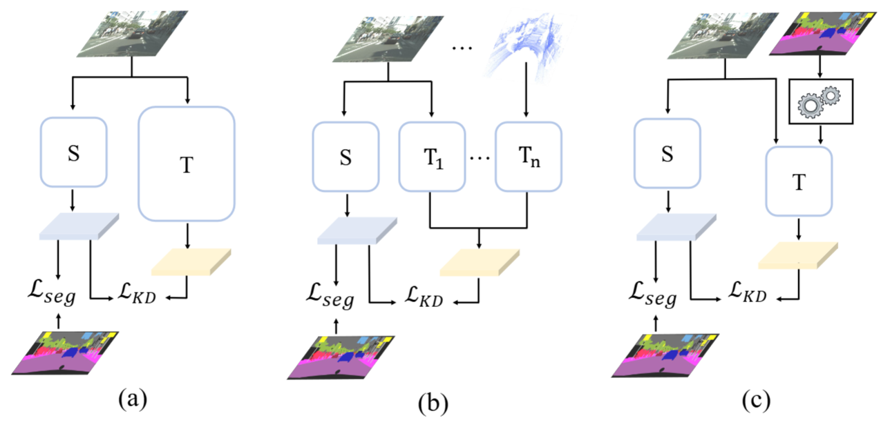

## Official code for our paper: Make a Strong Teacher with Label Assistance: A Novel Knowledge Distillation Approach for Semantic Segmentation

<pre>
Make a Strong Teacher with Label Assistance: A Novel Knowledge Distillation Approach for Semantic Segmentation
Shoumeng Qiu, Jie Chen, Xinrun Li, Ru Wan, Xiangyang Xue, and Jian Pu
Corresponding-author: Jian Pu
</pre>

## Abstract
In this paper, we propose a novel knowledge distillation approach for the semantic segmentation task. Different from previous methods that rely on power-trained teachers or other modalities to provide additional knowledge, our approach does not require complex teacher models or information from extra sensors. Specifically, for the teacher model training, we propose to noise the label and then incorporate it into input to effectively boost the lightweight teacher performance. To ensure the robustness of the teacher model to the noise, we propose an effective dual-path consistency training strategy with a distance loss between the outputs of two paths. For the student model training, we keep it consistent with the standard distillation for simplicity. Our approach can effectively improve the performance of knowledge distillation and offers more flexibility in the choice of models between teachers and students. Extensive experiments on five challenging datasets including Cityscapes, ADE20K, PASCAL-VOC, COCO-Stuff 10K, and COCO-Stuff 164K, five popular models: FCN, PSPNet, DeepLabV3, STDC, and OCRNet, demonstrate the effectiveness and generalization of our approach. We believe that incorporating label into the input as shown in our work will bring insights into the related fields.

<p align="center">
        
</p> 


## Requirement

Ubuntu 18.04 LTS

Python 3.8 ([Anaconda](https://www.anaconda.com/) is recommended)

CUDA 11.1

PyTorch 1.8.0

NCCL for CUDA 11.1

Install python packages:
```
pip install timm==0.3.2
pip install mmcv-full==1.2.7
pip install opencv-python==4.5.1.48
```

For more details, please refer to [CIRKD](https://github.com/winycg/CIRKD).

Backbones pretrained on ImageNet:

[resnet18-imagenet.pth](https://drive.google.com/file/d/1_i0n3ZePtQuh66uQIftiSwN7QAUlFb8_/view?usp=sharing) 


## Performance of Segmentation results on Pascal VOC, * denotes the model takes the noised labels as privileged information. We provided pretrained weights in checkpoints folder.


The Pascal VOC dataset for segmentation is available at [Baidu Drive](https://pan.baidu.com/s/1MX2ea7rNRqbDqOKQ8E6XpQ?pwd=d2fp). Our checkpoint files are at [checkpoints](https://github.com/skyshoumeng/Label_Assisted_Distillation/tree/main/checkpoints)


| Teacher | Student | Method | Val mIoU|
| -- | -- | -- |-- |
| DeepLabV3-ResNet101| DeepLabV3-ResNet18|Baseline| 73.21 | 
| DeepLabV3-ResNet101| DeepLabV3-ResNet18|CIRKD| 74.50 |
| DeepLabV3-ResNet101| PSPNet-ResNet18|Baseline|73.33|
| DeepLabV3-ResNet101| PSPNet-ResNet18|CIRKD|74.78 |
| DeepLabV3-ResNet101| DeepLabV3-ResNet18* |Ours| 75.0 |
| DeepLabV3-ResNet101| PSPNet-ResNet18* |Ours|75.4 |


Our code borrows heavily from [CIRKD](https://github.com/winycg/CIRKD), we thank the great opensource project CIRKD.

